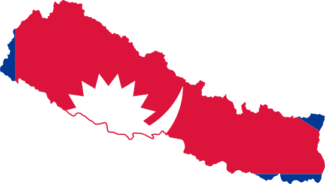

<p align="center">

</p>

<h3 align="center">states-nepal</h3>

<p align="center">
<b>
🇳🇵 Get structured data about administrative division in Nepal.

</b>
</p>

<p align="center">
 <a href="https://www.npmjs.com/package/states-nepal">
    
 </a>
  <a href="https://npmcharts.com/compare/states-nepal?minimal=true">
    
 </a>
 
<a href="https://github.com/adarshaacharya/states-nepal/issues">
      
    </a>
    <a href="https://github.com/adarshaacharya/states-nepal/pulls">
      
    </a>

</p>

<p align="center">
    <a href="https://github.com/adarshaacharya/states-nepal/issues">Report Bug</a>
    ·
    <a href="https://github.com/adarshaacharya/states-nepal/issues">Request Feature</a>
    ·
    <a href="https://github.com/adarshaacharya/states-nepal/issues">Ask Question</a>

  </p>
  <p align="center">states-nepal is a npm package that helps to get the dataset about different administrative division of Nepal like provinces, districts, categories,etc. Install and use the package on any Javascript/Typescript based on Node.js or browser environment! </p>

## Installation

```bash
$ npm install states-nepal
```

## Support

**Applications :**

- Node.js 
- Browsers

**Import :**

- CommonJS Module
- ES Module

**Languages :**

- English
- नेपाली

## Documentation

There are two documentations ready for this package :

#### Data Docs

All data are collected from wikipedia and various Nepal government sites. We have data set in Nepali and English format for following four entities. Explore more details about data by checking following docs.

- [Provinces](./docs/data/provinces.md)
- [Districts](./docs/data/districts.md)
- [Municipalities](./docs/data/municipalities.md)
- [Categories](./docs/data/categories.md)

#### Usage Docs

See the how to implement the package on your Javascript applications on following docs:

- [Provinces](./docs/usage/provinces.md)
- [Districts](./docs/usage/districts.md)
- [Municipalities](./docs/usage/municipalities.md)
- [Categories](./docs/usage/categories.md)

## Release Notes

Read [Change Log](CHANGELOG.md) for complete logs.

## Contributing

I would love to have some of your contributions to this project. You can checkout [Contributing Guide](CONTRIBUTING.md) for Contribution guidelines.

## Contributors

This package is inspired from the Php composer package [local-states-nepal](https://github.com/sagautam5/local-states-nepal). Massive thanks to [Sagar Gautam](https://github.com/sagautam5) for providing the dataset.

## Show your support

Give a ⭐️ if you like the project! :tada:

## Author

- Website: <https://adarsha.dev/>
- Twitter: [@adarsha_ach](https://x.com/adarsha_ach)
- Github: [@adarshaacharya](https://github.com/adarshaacharya)
- LinkedIn: [@adarshaacharya](https://linkedin.com/in/adarshaacharya)

## License

Copyright © 2021 [Aadarsha Acharya](http://adarsha.dev/).<br />
This project is [MIT](https://github.com/adarshaacharya/states-nepal/blob/master/LICENSE) licensed.
